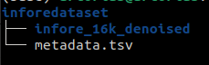
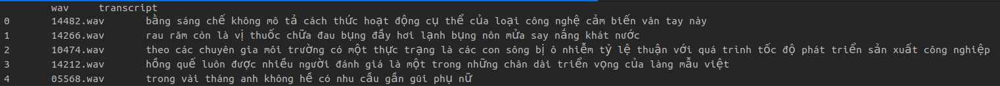

# Vietnamese Speech Synthesis with VITS text to speech model and TTS Coqui framework

This repository is dedicated to the customization and training of VITS [(Conditional Variational Autoencoder with Adversarial Learning for End-to-End Text-to-Speech)](https://arxiv.org/abs/2106.06103) for text-to-speech (TTS) applications using Vietnamese language data, utilizing the TTS Coqui framework.
The repository contains the necessary code and resources to train VITS specifically for generating high-quality speech from Vietnamese text. 


## Pre-requisites
1. I highly recommend you to use conda virtual environment, with Python 3.11.5.
```bash
conda create -n vits python=3.11.5
```
2. In this repo, I use TTS framework version 0.17.5 for statibility.
```bash
pip install TTS==0.17.5
```

## Dataset 
- [Infore](https://huggingface.co/datasets/ntt123/infore/blob/main/infore_16k_denoised.zip): a single speaker Vietnamese dataset with 14935 short audio clips of a female speaker.
- After downloading and extracting dataset zip file, the directory tree should be like the image below with infore_16k_denoised folder contains all the .wav files and the metadata.tsv file contains all the wav filenames and their texts.
- To load data samples, you have to define your formater function. I have defined my own formater function for this dataset in `formater/customformater.py`, you can customize your own for other datasets.

<div align="center">


</div>


## Training
Run the following command
```bash
python train_vits.py \
--output_path [output path for the training process] \
--data_path [path to the dataset directory] \
--restore_path [path to a pretrain model checkpoint] \ 
--epoch [number of epochs] \
--batch_size [batch size] \
--eval_batch_size [eval batch size] \ 
--continue_path [Path to a training folder to continue training] \
--sample_rate [sample rate of the audio data] \
--meta_filename [name of the metadata file] \ 
```

## Inference
```python
from TTS.api import TTS

tts = TTS('vits_tts',
          model_path='path to the .pth file ',
          config_path='path to the config.json file')

tts.tts_to_file(text="Your example text", file_path="your_filename.wav")
```

## Examples
| Ground truth audio   | Synthesized audio (model after 44k training steps)    |
| :---: | :---: |
|  <audio src="audios/14482.mp3" controls preload></audio>  |   <audio src="audios/vits1.mp3" controls preload></audio>   |
|  <audio src="audios/14266.mp3" controls preload></audio>  |   <audio src="audios/vits2.mp3" controls preload></audio>   |